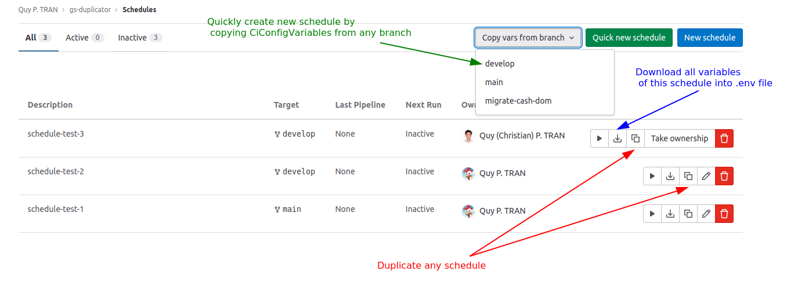
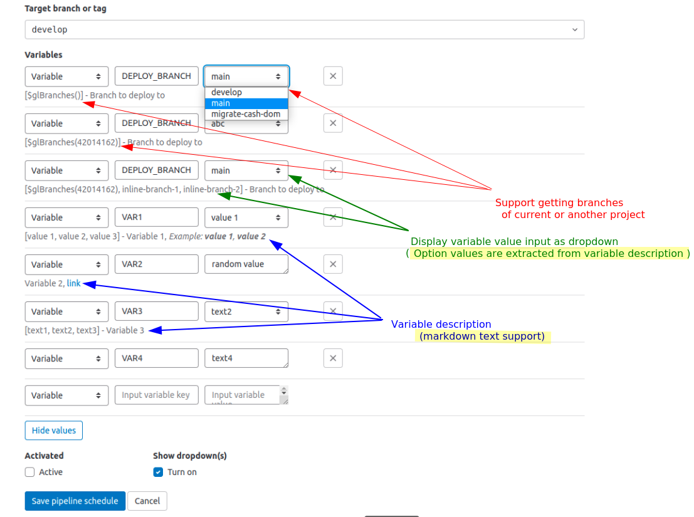

# Gitlab Schedule Duplicator

Gitlab Schedule Duplicator is a user script that allows you easily duplicate, create, or update the Gitlab pipeline schedule.

## Features





## Installation

1. Install a user script manager:
	- Install [Tampermonkey](https://chrome.google.com/webstore/detail/tampermonkey/dhdgffkkebhmkfjojejmpbldmpobfkfo) extension for Chrome.
	- Install [Greasemonkey](https://addons.mozilla.org/en-US/firefox/addon/greasemonkey/) extension for Firefox.
2. Click [here](https://gitlab.com/tranphuquy19/gs-duplicator/-/raw/main/dist/gs-duplicator.user.js) to install the script.
3. Go to Gitlab and enjoy!

## Usage

### Create or duplicate a schedule

1. Go to the pipeline page.
2. Click the "Duplicate" button to duplicate the schedule. The schedule will be created with the same configuration as the current pipeline. Provide access token if the browser requests it. The access token needs to have the `api` scope. Click [here](https://gitlab.com/-/profile/personal_access_tokens) to create a new access token.

### Edit a schedule

Note: The dropdown option is extracted from the variable description of the CiConfig (aka. `.gitlab-ci.yml`) file.
<br>
The description of the variable must be in the following format:

```yaml
variables:
	MY_VARIABLE:
		value: "option1"
		# The options are wrapped in square brackets and separated by commas (,). Must be at the beginning of the line.
		description: "[option1, option2, option3] - description" # <- this is the description
```

Following options will be replaced by the corresponding values:

| Text                            | Description                             |
|---------------------------------|-----------------------------------------|
| `$glBranches()`                 | Returns all branches of current project |
| `$glBranches(:gitlabProjectId)` | Returns all branches of a project by Id |

| And that's it! Discover more features by yourself.

## Contributing

I'm open to any contributions. Feel free to open an issue or a pull request. Thank you! <3

## License

[MIT](LICENSE) © [Quy P. TRAN](https://github.com/tranphuquy19)
